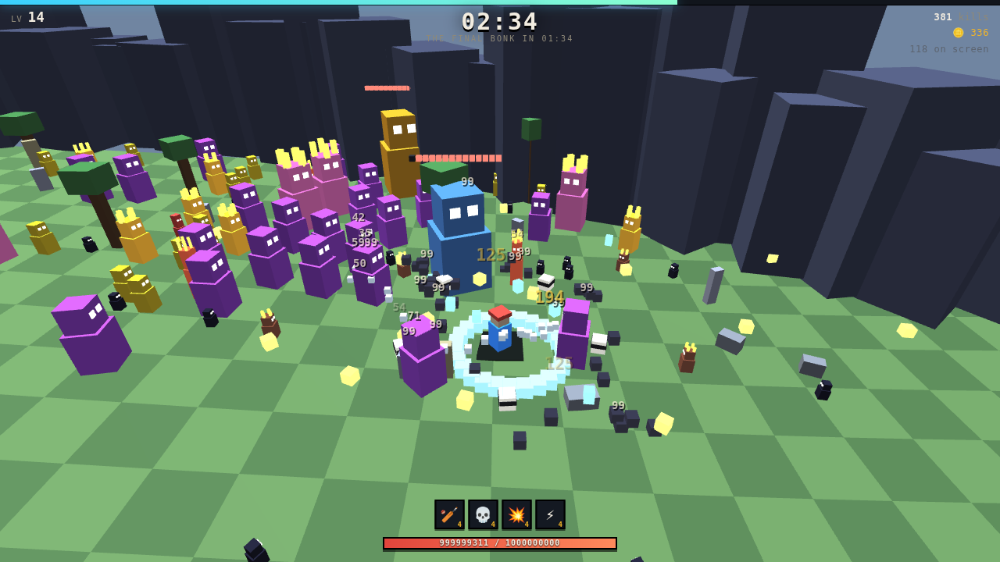
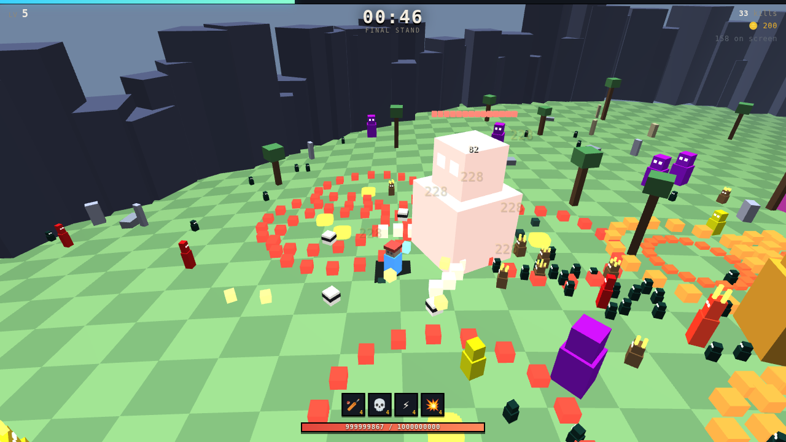

# BONKHORDE

[](https://github.com/srobster22-rob/estate-liquidators/actions/workflows/ci.yml)

**▶ [Play it in your browser](https://srobster22-rob.github.io/estate-liquidators/bonkhorde/)**

**A 3D survivors-like in one HTML file.** Vampire Survivors' auto-attacking horde loop, played
from Megabonk's third-person camera. No engine, no build step, no dependencies — open
`index.html` in a browser and it runs.

> A collector died, and the estate is large enough to have its own weather. Nothing in it was
> ever thrown away, so everything in it has been sitting there long enough to **wake up**. The
> mop woke up. The bin woke up. The ledger woke up, and it has been counting.
>
> You are one of those things. At dawn the house goes to probate and is signed away — and
> before then **the claims** arrive. Every debt the collector left, walking in through the walls
> to take what it is owed. They do not negotiate.
>
> **Twenty minutes. Clear the house.**

You never attack. Every weapon fires on its own cooldown at its own targets. The only verb is
**positioning**, and every death is a positioning mistake.

The horde is not undead, it is **accounting** — which is why the roster is a mop and a wheelie
bin, and why the things coming through the walls are an overdue notice, a bailiff, a safe, an
appraiser and a silverfish. The contents of the house are defending the house.

| the claims | what it is | how it plays |
|---|---|---|
| **ARREARS** | an overdue notice that learned to walk | slow, patient, always more |
| **BAILIFF** | all elbows and clipboard | gets there first |
| **THE LIEN** | a safe with legs — a charge against the property | slow, enormous, 150 HP |
| **APPRAISER** | hangs back and throws valuations across the room | the only one that outranges you |
| **SILVERFISH** | eats paper, breeds in filing cabinets | tiny, 5.0 m/s, arrives in numbers |
| **THE HEIRLOOM** | the one thing worth keeping, and it knows it | flees; pays coins if you catch it |

And they answer to someone: **THE EXECUTOR** at 5:00, **THE LANDLORD** at 10:00, **MR. TEETH**
at 15:00, and **THE FINAL BONK** at 19:00.

You play a **monster**, and it evolves twice while you are running it. At level 7 and level 20
it becomes a *different animal* — new name, new body, better stat block, and at the top of its
line a named signature. A MOPLING is a mop with eyes; a MOPHAND has grown arms it drags
mop-heads on; a MOPMAW is mostly mouth. **Twenty-one forms, twenty-one meshes** — asserted, not
promised. Between runs each monster keeps the XP it earned and levels on its own.



---

## Play it

[In your browser](https://srobster22-rob.github.io/estate-liquidators/bonkhorde/), or locally:

```
open bonkhorde/index.html          # macOS
xdg-open bonkhorde/index.html      # Linux
```

`WASD` move · `MOUSE` orbit camera · `SPACE` jump · `ESC` pause.

**Bunnyhop.** Hit `SPACE` again on the frame you land and you keep the momentum: five links,
+5.5% move speed each, +28% at the top of the chain. Miss the window and it bleeds off over a
couple of seconds; take a hit and it is gone instantly. The window is 0.16s after touchdown
plus a 0.14s pre-land buffer, so a press made on the way down still counts — without that the
input has to land inside a single 16ms frame, which is a coin flip rather than a skill. A held
spacebar does nothing: it has to be a press.

**On a phone:** left thumb is a virtual stick (analog — a half push moves you at half speed),
right thumb turns the camera, a tap on the right jumps, and there is a pause button because
a phone has no Escape key.

Nothing decides "is this a phone" up front. Both input paths are always installed and pointer
lock is always attempted; the auto-pause keys off whether a lock was ever genuinely *held*.
Guessing from `maxTouchPoints` killed mouse control on touchscreen laptops, and swapping it
for a media query only moves the guess — an emulated touch desktop reports
`(any-pointer:fine) = false`, byte-identical to a phone.

Survive twenty minutes. Four bosses arrive at 5:00, 10:00, 15:00 and 19:00. Coins persist
between runs and buy permanent upgrades.

**The clock does not win the run.** THE FINAL BONK arrives at 19:00, and if it is still alive
at 20:00 the timer stops mattering — you go to **sudden death**, the horde thickens for as
long as you stall, and victory means killing it. You have four minutes.

**Bosses have moves.** Every ability keeps the same contract: a wind-up you can see, a danger
zone drawn on the ground, then the hit. A red ring says *where*, a second ring closing inward
says *when*. Dodging halves the damage a boss deals — measured, not asserted.

| | |
|---|---|
| **THE GRAVELORD** 5:00 | `slam` — a ring under your feet, then a stomp. One lesson, taught once. |
| **THE LANDLORD** 10:00 | `evict` — scatters lingering zones that eat the arena, plus slams. |
| **MR. TEETH** 15:00 | `charge` — marks a lane, pauses, then runs it at 4.4× speed. |
| **THE FINAL BONK** 19:00 | all of the above plus `spokes`, a radial burst you dodge between. |



---

## What's in it

| | |
|---|---|
| **8 weapons** | melee arc, orbiters, homing bolts, shockwave, mortar, chain lightning, damage aura, ground hazards |
| **8 evolutions** | each weapon maxed + a specific passive at rank 3 unlocks a replacement form |
| **8 passives** | every one contributes to output, not just the four with "damage" in the text — PLATING blasts attackers off you, MAGNET drags the horde into a pile |
| **5 enemy types + 4 bosses** | with a spawn director that reweights the mix over 11 phases |
| **elite variants** | from minute 6, rising to ~1 in 5 — crowned, larger, 3.2× HP, 5× XP |
| **4 boss abilities** | slam, evict, charge, spokes — telegraphed, dodgeable, worth dodging |
| **7 monsters, 21 forms** | a mop, a wheelie bin, a storm, a boulder, a fungus, a ledger beetle and a swarm — each a three-stage line that evolves at run level 7 and 20, every form its own hand-built body |
| **per-monster levels** | every run banks its XP into the monster that ran it: +2% HP and +1.2% damage a level, that monster only, forever |
| **bunnyhopping** | chain a jump on the frame you land for up to +28% move speed; one hit resets it |
| **9 permanent upgrades** | bought with coins, persisted to `localStorage` |

Roughly 1,600 lines of JavaScript, no libraries.

## How it's built

**Rendering.** Hand-rolled WebGL. Everything dynamic is an axis-aligned box, and all of them
go into a single vertex buffer that is uploaded once and drawn in one call — ~2,300 boxes per
frame at peak. The alternative, one `drawElements` per object, costs more in driver overhead
than the entire simulation does. Terrain is a separate static buffer: a 60×60 heightfield with
a checkerboard tint, because a flat untextured plane gives you no sense of speed.

**Simulation.** Enemies are bucketed into a uniform spatial grid, rebuilt each frame. Every
weapon query (nearest target, everything in radius) and enemy-vs-enemy separation runs against
it. Without that, separation is O(n²) at n≈400 and the horde collapses into one stacked
super-enemy that is both invisible and unkillable.

**Audio.** A ~40-line Web Audio synth. No files.

**Cost.** The simulation is **0.4 ms/frame at 300 enemies** — a ~2,400 fps ceiling — so the
frame budget is entirely rendering. (The harness reports ~10 fps under load, but that is
SwiftShader rasterising in software; the sim number is the one that transfers to real
hardware.) Measured, not assumed: `window.__g.perf()` splits the two.

---

## Verification

The game ships with a headless harness that drives it through a `window.__g` QA hook — the
same pattern as `proto3d/` in the parent repository.

```bash
npm i playwright && npx playwright install chromium

node test.js              # 199 checks: boot, every weapon, every evolution, every
                         # enemy, elites, boss abilities, evolution partners,
                         # draft rules, colour-vision contrast, edge camera,
                         # every character, a full run, the sudden-death gate,
                         # death, saves, draw budget, render, and touch controls
                         # in a real phone-sized touch context
node balance.js 6 both            # [trials] [first|vet|both] [char,char]
node balance.js 12 vet intern,scrap   # higher n on two characters
node dps.js 8 5                   # per-weapon boss/crowd/survival bench
                                  # [dps trials] [survival trials]; n=3 is noise
node passives.js 5                # per-passive offence/defence bench, n=5
node starters.js 8                # one character, every starting weapon, n=8
node mutate.js                    # break the game on purpose, one thing at a
                                  # time, and check the suite notices
```

`test.js` covers each of the 8 weapons and all 8 evolutions individually, spawns every enemy
type and boss, plays a complete run to the 20:00 victory, verifies the player can actually
die, and checks that `localStorage` survives a reload. **199 passing.**

### Every weapon, on the two axes that decide a run

`dps.js` benches all eight weapons at rank 5 and evolved, inside the actual
sudden-death fight — horde present, gems pulling you back in, autopilot kiting —
and attributes boss damage separately from crowd damage. Boss DPS decides whether
you can *close* a run; crowd DPS decides whether you survive to try.

```
RANK 5        boss   crowd   alive      EVOLVED           boss   crowd   alive
bat             78    1492    4:46      MEGABONK           919    3346    4:20
skulls         110    1227    5:03      CAROUSEL          1351    3540    4:24
bolt           127    1226   10:58      BOLTSTORM         1229    3595   15:31
pulse           66    1656    4:45      EARTHQUAKE         665    3087    3:52
mortar         450    2292    6:16      BOMBARDIER        1422    3590   10:07
zap            219     574    6:28      TESLA COIL         512    1521   10:33
aura            80    1388    4:16      PLAGUE             850    3026    3:55
caltrops       366    2046    4:13      SCORCHED EARTH    1137    2960    4:13
                                        (dps n=6, survival n=4)
```

**The third column is new, and it says the second one was never measuring what we
thought.** EARTHQUAKE has the highest crowd DPS among the player-centred weapons
and the *worst* survival in the game. BOLT has nearly the lowest rank-5 crowd DPS
and stays alive **more than twice as long as anything else**. Sort either table by
survival and the same three names come out on top — BOLT, MORTAR, ZAP — and they
are exactly the three weapons that reach. The other five cluster at 3:52–4:24
evolved, a 3.5× cliff with nothing in between.

That is not a tuning error, it is the shape of the game: crowd DPS counts damage
that landed and cannot count *where*, so a kill at 30m and a kill at 2m score
identically and are not remotely the same thing. Trimming BOLTSTORM's throughput
by 23% (9 → 7 bolts, 5 → 4 pierce) took its crowd DPS from 4689 into the pack at
3595 and moved its survival by **eight percent**, from 16:49 to 15:31 — volume was
never what kept it alive. The single most consequential draft decision in this
game is whether anything in your kit has reach.

Specialists are intentional — ZAP is a boss weapon that barely dents a crowd,
AURA the reverse. What the bench is for is catching the ones that are not
specialists but simply broken, and the test it applies is **strict dominance**:
a weapon that beats every other weapon on *both* axes at once is not a
specialist, it is a default. Unevolved MORTAR was exactly that — best boss DPS
*and* best crowd DPS against all seven others — before reach started counting
bodies. It no longer is: CALTROPS out-damages it against a boss and it keeps
the crowd, which is a trade rather than a default. Nothing dominates either
table now.

### Colour-vision contrast

You have to tell a SPRINTBOI (charges you) from a SPITBOI (holds at range) at a
glance, in a crowd, while running. The palette was picked by eye and collapsed
for the ~8% of men with a colour-vision deficiency.

The first attempt at this **shipped a fix that did not work, and a test that said
it did.** The check modelled scene lighting as a flat ×1.35 — which is the
*ground's* multiplier. An enemy's side face, which is most of its silhouette at a
37° camera, actually receives ×0.92 sunlit and ×0.50 shaded, per channel. Scored
under light the enemies never receive, the palette read ΔE 26.9. Scored properly
it was **ΔE 2.8**, and the check had also never compared elites to each other or
to the ground at all.

Corrected, the harness now compares 10 enemy variants (5 types + their elite
tints) against each other and against 6 terrain shades, across 4 vision types and
both lighting conditions —
and it derives the terrain colours and the lighting constants from the renderer
rather than retyping them, so a recolour cannot slip past it.

| | worst pair | worst vs ground |
|---|---|---|
| original hand-picked palette | ΔE 18.8 | ΔE 14.4 |
| "fixed" palette, measured wrongly | ΔE 26.9 | ΔE 26.3 |
| the same palette, measured correctly | **ΔE 2.8** | **ΔE 0.6** |
| re-searched against real lighting | **ΔE 19.7** | **ΔE 20.0** |

Two things fell out of doing it properly:

**The elite tint was costing ~4 ΔE.** Mixing 34% toward orange pulled every
species toward one hue. Elites already carry a crown, +38% size and a glow, so
the tint only needs to hint — it is now 12%, with brightness taking the slack.

**Eleven distinguishable colours is not achievable.** Five enemies, five elite
tints and the player, all mutually separable under four vision types at two
lighting levels, against grass — the best player colour tested still sat at ΔE
7.5 from something. So the player stopped competing for a hue and is marked by
**shape** instead: a bright ring nothing else draws, which no deficiency can take
away. Knowing when to stop using a channel is part of using it.

### The map had two different edges

The boundary was a **square** movement clamp 148m across, and the only thing in the world that
looked like a wall was a ring of decorative spires at radius 74. A square's corners sit thirty
metres past that ring, so the wall was scenery you walked straight through and the map kept
going into empty checkerboard on the other side — and side events clamped to the same square,
which is how they ended up spawning out there with you.

It is one shape now: a play radius of 84 — the same area as the old square, because shrinking
it turned out to matter more than fixing it (see the findings below) — a continuous wall of
182 slabs drawn at exactly that radius, and every spawn, every enemy, every hazard and the
camera all confined to it. The
player slides along it instead of sticking, and the velocity component aimed into it is dropped
— otherwise you accumulate speed you are not travelling at and the hop chain cashes it in the
moment you turn away.

Two things went wrong on the way, both of them caught by adding an assertion rather than by
looking:

- **The wall shipped as a picket fence.** `box()`'s local X axis maps to world `(cos r, −sin r)`,
  so rotating each slab by `−θ` points its long axis straight out from the middle. 150 radial
  spokes with daylight between every one — and the assertion in the suite checked *position*,
  which was correct the whole time. The check now walks the ring at every half-degree and asks
  whether there is material there; a fence fails it at the first gap.
- **The camera clamp was still a square.** Same bug, one function along: a boom pointed at a
  corner is 103m from the middle before a half-extent of 73 notices it, so backing into the wall
  put the eye outside looking in. It solves for the largest fraction of the boom that still ends
  inside the ring, and the floor on that fraction came down from 0.34 to 0.18 — at 0.34 the eye
  could still finish five metres past the wall, inside the buttresses, which is the *next*
  section's bug coming back through the door it was fixed at.

### The camera went blind at the arena edge

Found while re-shooting screenshots. The chase boom is 17 units long and
unbounded, so near the edge the eye ends up out among the boundary spires
(radius 74–79, height 7–15) at an eye height of ~12.8 — inside them, with the
whole frame rendering as fog. Clamping the eye sideways fixes the blindness but
slides the camera onto the player and loses the third-person view; the boom now
*shortens* until it fits and lifts as it shortens, so the player stays framed.
Asserted from the centre, an edge and a corner.

### The monsters, and what an evolution is allowed to be worth

Seven lines, three forms each. The stage mods are **absolute** multipliers against the base
stat block rather than increments — stage 3 is ×1.38 HP *total*, not ×1.38 on top of stage 2 —
which is what lets `evolveTo()` compute the ratio between any two stages and apply it once, and
lets a test jump straight to the top of a line without walking it.

| | stage 1 | stage 2 (LV 7) | stage 3 (LV 20) | signature |
|---|---|---|---|---|
| MOP | MOPLING | MOPHAND | MOPMAW | SWEEP — +20% weapon reach |
| SCRAP | RUSTLET | RUSTJAW | RUSTLORD | SALVAGE — +60% pickup radius |
| VOLT | ZAPLET | VOLTHOUND | STORMWICK | OVERCLOCK — −13% cooldowns |
| STONE | LUGGIT | HAULOX | MONOLITH | BEDROCK — +5 flat armour |
| ROT | MOULDLING | ROTHERD | GRAVEMAW | FEAST — regeneration ×2.4 |
| TALLY | TALLYMITE | LEDGERLING | GRAND AUDITOR | COMPOUND — +15% XP |
| ECHO | SPLITKIN | TWINSPAWN | TRIPLICATE | CHORUS — +28% damage |

Each line is a different *kind* of thing, not a palette swap, and each stage changes the
silhouette rather than the scale:

| | it starts as | it becomes | it ends as |
|---|---|---|---|
| **MOP** | a fringe with two eyes under it | arms, each dragging a mop head | mostly mouth, four arms, a mane |
| **SCRAP** | a bucket whose lid won't sit straight | a wheelie bin, lid as a jaw | a skip with a crown and a grabber arm |
| **VOLT** | an orb with antennae | the orb grew a body and it runs | a cloud with a skull in it and its own rain |
| **STONE** | a pebble with a brow | a boulder carrying cargo on a yoke | a standing stone, hovering, trailed by rubble |
| **ROT** | a puddle with one mushroom | a slime under a mushroom forest | a headstone that grew a mouth and two hands |
| **TALLY** | a beetle whose shell is a ledger | the shell opened; it audits from the air | a filing cabinet that stood up, with a monocle |
| **ECHO** | two of it | three, and one wears a crown | four, dragging after-images |

Nothing in a body plan animates a *size*, only positions — so `__g.bodySig()` (box count plus
every box's half-extents, sorted) is stable frame to frame, and two forms built from the same
mesh come back byte-identical. The suite reads all twenty-one and requires twenty-one distinct
strings. **The version this replaced would have failed that check with 3 distinct out of 21.**

**Evolving heals exactly the HP it added, and no more.** More than that and level 7 is a panic
button you save for a bad moment; less and a +16% maxhp bonus reads on the HP bar as a *loss*,
which is how it looked the first time. The assertion is the equality, not an inequality.

An evolution also queues a level-up pick of its own, on top of the level that triggered it —
the moment should hand you a decision, not just a bigger number.

**Per-monster levels** are the between-runs half. Every run banks its gross XP into whichever
monster ran it, and a monster level is +2% HP and +1.2% damage *for that monster alone*. The
first level costs 250 XP and each one after adds 320, so a two-minute death still visibly moves
the bar — a progression bar that does not move on a bad run teaches you that bad runs are worth
nothing, which is the opposite of what a survivors-like needs you to believe.

### Every passive, against a no-passive control

Reaching an evolution means feeding one specific passive for about three of your
picks, so the question is not "does the text say damage" but "is it a comparable
pick". `passives.js` benches each one at rank 3 — the evolution gate — against a
control with an identical weapon kit.

```
                    dps   vs base   survived   vs base            (n=10)
control            2166        --      10.9m        --
spinach            2726       26%      11.3m        4%   offence partner
dupe               2788       29%      11.5m        6%   offence partner
tempo              2569       19%      12.2m       12%   offence partner
clover             2421       12%      10.9m        0%   offence partner
heart              2355        9%      12.7m       16%   defence partner
boots              2362        9%      11.0m        1%   defence partner
magnet             2275        5%      11.5m        5%   defence partner
plating            2245        4%      12.7m       17%   defence partner

  offence partners   avg +21% dps,  +5% survival
  defence partners   avg  +7% dps, +10% survival
```

It used to read **+25% dps / 0% survival** against **−0% dps / +4% survival**: half
the roster ramped its power while chasing an evolution and half simply did not,
for the same reward. The two rows now separate on the axis their names promise —
offence buys damage, defence buys minutes — and no passive dominates another on
both. All four of the quiet ones contribute in their own idiom rather than by
bolting "+damage" onto everything:

| | |
|---|---|
| **BOOTS** | momentum — speed *and* damage. It measured as the single worst pick in the game: +27% move speed at rank 3 produced nothing detectable. |
| **BIG HEART** | a bigger heart pumps harder. HP, regen, and damage. |
| **PLATING** | spiked armour. Being hit blasts them off you, which rewards the tank build for doing the thing it is built to do. |
| **MAGNET** | it pulls more than loot. A weak inward drag on the horde clumps them, so every AoE weapon lands more — and brings them closer to you, which is the cost. |

### Balance is measured, not guessed

`balance.js` runs an autopilot to death, many times over, and reports where runs actually end.
Tuning a survivors-like by feel is how you ship something unwinnable in week one, so the
difficulty curve here is a measurement. Current state, all seven monster lines, 6 trials per
cell, monster levels at 1 so this reads the in-run evolution and nothing from the meta layer:

```
                            median              clears
FIRST RUN   MOPLING          05:13                0/6
  (no perm  RUSTLET          10:57                0/6
  upgrades) ZAPLET           06:12                0/6
            LUGGIT           10:47                0/6
            MOULDLING        04:29                0/6
            TALLYMITE        04:35                0/6
            SPLITKIN         05:03                0/6
                                                  0/42

VETERAN     MOPLING          24:00                2/6
  (all      RUSTLET          22:32                4/6
  upgrades  ZAPLET           24:00                1/6
  bought)   LUGGIT           24:00                3/6
            MOULDLING        23:29                5/6
            TALLYMITE        23:51                4/6
            SPLITKIN         24:00                2/6
                                                 21/42
```

Which is the shape the genre wants, and it is the same shape it was before monsters, evolution
and bunnyhopping went in: **0 first-run clears in 42**, and **21 of 42** with a maxed shop
against 25 of 60 (42%) on the build before this round — the same number inside a noise floor
this table has already been shown to have. What did move is how far a first run *gets*: RUSTLET
and LUGGIT now median past ten minutes where every line used to die around four, and a lucky
run reaches sudden death and loses there. The ceiling is visible without being available, which
is what it is for.

The veteran medians read past 20:00 because almost every veteran run reaches sudden death and
is decided there — the fight being the fight.

**Side events changed what these numbers mean.** Caches and altars are a power source the
difficulty was never tuned against, worth +25 points of veteran clear rate measured against
the identical build with them frozen. The late curve absorbs that now, and the intent is that
twenty minutes is reachable **because** you went and got them — a first run can even scrape a
clear on a lucky one, roughly one in twenty-four, where before it was zero in sixty. That
ceiling being *visible but rare* is the shape the feature was for.

**50% is the target, not a miss.** An earlier draft of this file treated ~33% as the number to
hold, and every content change since had to be walked back toward it with boss HP. That was
cargo cult: the invariant that matters is *first run never clears and a maxed shop makes the
ending reachable*, and 0/42 against 21/42 says both. Chasing a third decimal on the veteran
figure through a ±10-point noise floor is measuring the harness, not the game.

The per-character spread is roughly the noise floor wide, and the ordering does not survive
re-sampling: MOULDLING led at 8/12 two rounds ago, sat at 4/12 the round after on an unchanged
character, and leads again here at 5/6. RUSTLET was the only line consistently at the bottom
across every sweep — a signal rather than noise, and it took three passes to close, at which
point it overshot into the top half and stayed there:

```
                        RUSTLET   control
starting point           1/12     MOULDLING 9/12
+8% speed                3/12     MOULDLING 8/12
+35% weapon reach        4/12     LUGGIT    7/12
this round               4/6      MOULDLING 5/6
```

**Read the total, not the rows — and be suspicious of the median.** The outcome is bimodal: you
die around minute six, or you go the distance. A median over six runs just reports which side
of that split got the fifth sample, and it swings wildly — THE SCRAPPER measured 15:20 and 06:31
on *identical* configurations twenty minutes apart. The clear count over the whole table is the
only number here worth acting on, and even that needs pooling: two sweeps of the same build one
round ago read 9/30 and 15/30. Anything smaller than a ten-point move is not a result.

Note the veteran medians read past 20:00 because sudden death runs the clock on. Survival time
is no longer the same thing as winning.

That harness has overturned eighty things this build believed:

- **A circle is not a square with the corners rounded off, and the bench said so before I
  noticed.** Replacing the 148×148 movement clamp with a play radius of 70 looked like a pure
  bug fix — the wall finally matched the boundary — and it cut the play area by 32%. THE
  SPARK's *first-run* median went from **3:59 to the full 24:00**, with 57 levels and eleven
  thousand kills, on a build where a first run had never once passed minute twenty. Two
  reasons, neither of them the wall:
  - **A third more density is a third more bodies inside every AoE**, and in a survivors-like
    the horde *is* the economy. Kills buy levels buy kills; the loop compounds off the first
    push.
  - **The despawn valve stopped venting.** Enemies are culled at 70m from the player, so a
    140m-wide arena means the cull can never fire and the horde only ever accumulates.

  The radius is 84 now — π·84² is 22,167 m² against the old square's 21,904. Same room, one
  shape. Held constant against the fix, the first-run death histogram goes back to what it has
  always been: **9 of 10 dead inside six minutes** with the two new mechanics switched off,
  and 7 of 10 inside eight with them on.
- **Half again the move speed is not a mechanic, it is a difficulty setting.** Bunnyhopping
  shipped at six links of +8.5% — 1.51× at a perfect chain — and the autopilot chains
  perfectly, because it jumps on the frame it lands. First-run median 4:06 → 9:14; THE
  SCRAPPER's to 24:00. Five links of +5.5% now, air acceleration cut to 16% of ground, and one
  hit resets the chain, which is the part that makes it point at clean play rather than at
  holding a button. `BONKHORDE_NOHOP=1` and `BONKHORDE_NOEVO=1` bench the same build without
  each, because a mechanic measured only in combination cannot be attributed.
- **The wall shipped as a picket fence and the assertion covering it passed.** `box()`'s local
  X axis maps to world `(cos r, −sin r)`, so rotating each slab by `−θ` points its long axis
  straight out from the middle: 150 radial spokes with daylight between every one. The check
  compared *positions*, which were right the whole time. It walks the ring at every half-degree
  now and asks whether there is material there — the widest gap anywhere on 528m of wall is
  under 0.1m.
- **The camera clamp was the same square bug, one function along.** A boom pointed at a corner
  is 103m from the middle before a half-extent of 73 notices it, so backing into the wall put
  the eye outside looking in through the slabs. It solves for the largest fraction of the boom
  that still ends inside the ring, and the floor on that fraction came down from 0.34 to 0.18 —
  at 0.34 the eye could still finish five metres past the wall, inside the buttresses, which is
  the *camera went blind at the arena edge* bug coming back through the door it was fixed at.
- **The camera was rendering the world from inside the wall, and the check said it was fine.**
  `camEye` is written by `render()`, and `render()` runs on `requestAnimationFrame` — not inside
  `__g.step()`. So a probe that stepped the sim ninety times per angle and then read the eye
  never re-rendered once: it reported "eye reached 11.7 of 84" with the player pinned against a
  wall 84 metres out, because 11.7 was the boom from whatever frame happened to have drawn last.
  It reported *exactly* 11.7 at radius 70 as well, which is the tell — a number that does not
  move when the map doubles is not measuring the map. Driving real frames, it failed on its
  first honest run at **84.1 against slabs occupying 83.45–84.55**: the eye was finishing inside
  the masonry. Shortening the boom cannot fix that alone — the floor on `k` is still two metres
  of boom and a player 1.5m off the wall has 1.5m of room — so the eye is projected back onto
  the ring afterwards, keeping the height it earned, and slides along the inside of the wall
  instead of climbing into it. The check now also asserts a *lower* bound, so "the camera never
  went anywhere" fails rather than passes.
- **An input window one frame wide is a coin flip, not a skill.** The bunnyhop window is 0.16s
  after touchdown *plus* a 0.14s buffer before it, so a press made on the way down still spends
  itself on landing. Without the buffer the press has to land inside a single 16ms frame. It is
  also a press and not a hold: `e.repeat` is rejected, because auto-hop from a held spacebar is
  free top speed for twenty minutes and nothing left to do well.
- **Two of the new assertions passed by measuring nothing, and one of my own instruments lied.**
  `spawnEvent()` returns the event's *kind*, not the event, so `.x` was `undefined`, `NaN > RIM`
  is `false`, and "no side event spawns outside the wall" was green across 300 spawns it never
  looked at. The camera-eye check read the boom three frames after a teleport, while `camAnchor`
  was still lerping from the middle of the map, and called an eye radius of 11.7 an edge case.
  And `jumpBuf` decremented once past zero and sat at −0.01 forever — harmless to the `> 0`
  test it feeds, and a hook that reports a negative buffer is still a hook that lies.
- **A time-based camera assertion, in a file whose own comment says not to write one.** "The
  anchor gets there" waited 1400ms and then checked — four lines under a comment explaining
  that the previous version of the same check failed because software rendering had not drawn a
  frame in the window it waited. It failed at 28.42 of 30 while a bench was hogging the machine.
  It counts frames now, like the half of the check that was already right.


- **A day cycle costs colour discrimination, and no palette buys it back.** One run is one
  evening now — afternoon, gold at the first boss, dusk by the third, night while you are
  counting seconds, and a blood-red horizon the moment sudden death starts. It is also
  information: you can read how deep you are from the sky without looking at the clock. But
  extending the contrast check across the cycle (6 times of day × 2 face orientations × 4
  vision types, up from 2 conditions) immediately failed it — CHONK and SKITTER at **dE 2.3**
  under tritanopia at the darkest hour, and THE COLLECTOR at **1.7** against the ground.
  - Scaling the night ambient up and down moved the worst pair from 2.3 to 5.5. It was never
    brightness — it was **saturation**. A strongly red ambient makes every object red, which
    destroys hue discrimination by construction. Colour lives in the key light and the fog now;
    the ambient stays near neutral.
  - Re-running the colour grid search against the full cycle found **nothing above 12.1**, and
    the binding pair was `brute*` against the terrain — a constraint no choice of collector
    colour could move. The existing palette simply cannot hold dE 15 against the ground once
    the light changes.
  - So that separation is carried by a **contact shadow under every body**, which does not
    depend on hue, light level or the viewer's colour vision. Enemy-against-enemy is still
    hue's job at dE > 15 (15.2 now); enemy-against-ground is hue > 9 plus a guaranteed shadow,
    asserted as 47 shadows for 47 enemies. The graphics fix and the accessibility fix turned
    out to be the same fix, and the shadows also stopped everything looking like it was
    hovering, which it was.
- **My own instrument lost three dE in the refactor.** Moving the palette hook to report the
  whole day cycle changed the ground's diffuse term from the sun's vertical component to a
  vertical face's — the terrain is horizontal, so that is simply wrong, and it made the ground
  read darker than it is. Three dE of headroom that was never actually missing, which I nearly
  spent a palette redesign chasing.
- **An edit that silently did nothing, for two commits.** A `python3` block that was supposed
  to take the finale from 520k HP down to 430k ran against the wrong working directory. It
  printed nothing, changed nothing, and both the source comment and this file went on claiming
  430k while the constant sat at 520k. Every measurement after it is consistent, because the
  value never moved — it was only ever the prose that was wrong. It surfaced because a
  screenshot's HUD read "520,000 HP" while I was looking at something else entirely.
- **The third event type was unreachable for four different reasons, none of them the one I
  guessed.** THE COLLECTOR flees instead of charging — the only thing in twenty minutes that
  asks whether you can bring damage *somewhere* rather than wait for it to arrive. It was
  caught **zero times across six full runs**. In order: a quarry that never stops is a
  treadmill, so it pauses now; the autopilot chased it across the whole arena and stopped
  completing altars entirely, so its pull is weaker than a cache's; auto-targeting never
  picked it because a fleeing enemy is never the nearest thing, so `threatTarget` weights it
  at 120 and `nearest` counts it as four times closer than it is. And then it *still* took
  zero damage at 6.8m with a full kit — because in a bullet-hell your projectiles are eaten by
  whatever they pass through. BOLT dies in the crowd metres from you, ZAP's chain is a 13m
  leash, MORTAR aims at density and the bat is melee. **The horde is armour.** So it is run
  down instead: 4.6 m/s, faster than anything else on the field and slower than you, which
  makes catching it a positional problem — the only kind this game has.
- **And the run that proved all of that was measuring a bot with one rank-1 bat.** The probe
  used `drainPicks(true)`, which sets `noLevels` and suppresses level-ups for the whole run.
  Twenty simulated minutes, no weapons, and I read four rounds of conclusions off it. With the
  bot actually levelling: 16–17 events a run, 4–6 caches, 4–7 altars, **3–4 collectors caught**,
  and only 1–4 expiring.
- **It pays in coins, and that is the design lesson from the round above.** Everything paid
  into the current run has to be balanced against the whole difficulty curve, and three
  attempts to do that went backwards. Coins pay into the shop instead, so a hunt can be as
  generous as it likes without touching the run it happened in. Measured with all three types
  live: **13/24 veteran clears against 7/24 with events frozen** — going and getting them
  nearly doubles your chances, which is the claim the feature was for.
- **The colour-vision harness rejected the new enemy on sight.** THE COLLECTOR's first colour
  was a warm yellow at dE 8.1 from SPITBOI under tritanopia, against a threshold of 15. Ten of
  the eleven hues this palette needs were already spoken for, so the replacement came from a
  grid search over RGB scored by *the suite's own CIELAB maths* rather than by eye — a search
  that scores candidates differently from the check they have to survive is a search for the
  wrong thing. Worst pair 18.5, worst against any terrain shade 17.6.
- **Spawning enemies as the "cost" of a reward is a reward.** Caches and altars went in as
  optional content — a chest you walk into, a shrine you hold ground on — and took veteran
  clears from 46% to 71%. The obvious fix was to guard them: enemies around an opened cache,
  more arriving while an altar charges. That took clears to **92%**. In a survivors-like more
  bodies is more XP, and the horde *is* the economy: a cost billed in enemies is a discount.
  The altar bills health instead — 4% of your pool a second, ~16% for a full charge, and it
  cannot kill you outright, so the price of greed is the next hit rather than the altar.
- **A guaranteed level-up is worth the same at minute two and minute nineteen.** Replacing the
  cache's level-up with a fixed XP payout was meant to make it decay in relative terms late.
  It went the other way — 71% to 88% — because a fixed payout that is one level at minute
  nineteen is *five* at minute two, and everything downstream compounds off those five. Back
  to one level, which is also the readable version.
- **The finale had stopped being the binding constraint and I did not notice for two rounds.**
  With events live you arrive at THE FINAL BONK about fifteen levels stronger, so taking it
  from 370k HP to 520k — a 40% rise — moved clears by four points. The lever had to be the
  curve that makes the whole late game hard, not the last minute of it: `hpScale`'s quadratic
  term went 2.5 → 3.6, which is +29% at minute nineteen and +10% at minute ten, and the finale
  stayed at 520k. (An edit meant to bring it back down to 430k ran against the wrong working
  directory and silently did nothing — the constant never moved, so every measurement after it
  is consistent and it was the prose that was wrong for two commits. Caught by reading a
  screenshot's HUD, which is the only reason it was caught at all.)
- **The autopilot did not know the feature existed, so the first balance numbers measured a
  player who ignores it.** Teaching it to detour for a cache was easy. Holding an altar was
  not: across three full runs it completed **zero**, and every altar in the game expired
  unclaimed — standing still is the one thing every other term in that bot exists to prevent.
  Inside the ring it now scores "would this heading keep me in it" rather than "is this toward
  it", and the altar asks for less: 4.8m instead of 3.6, four seconds instead of 5.5, and a
  slower bleed so ducking out to dodge costs progress rather than ending it. The first pass
  also fired one every ~41 seconds — 29 a run, half expiring unvisited, which is wallpaper
  rather than an occasion. Now ~14.
- **And the events are only measurable because the bench can switch them off.** `BONKHORDE_
  NOEVENTS=1` runs the identical build with them frozen, which is the only way to say what
  they are worth rather than guess: 11/24 against 17/24, same characters, same n. Three rounds
  of tuning happened before that flag existed and every one of them was poking at a number
  with no control to compare it to.
- **Two pieces of text in the same place, at the moment the game most wants to tell you
  something.** Boss-name alerts were drawn at 19% of the viewport height, which on a phone in
  landscape is exactly where the phase line sits. Floored below the HUD header and scaled to
  the screen — 30px on a desktop, 19px on a 390-tall one. Both phone orientations verified for
  horizontal overflow while I was there: `scrollWidth` equals `innerWidth` and nothing sits
  past the right edge in either.
- **The starting weapon is a bigger lever than the entire character stat block.** Two new
  characters shipped and `balance.js` did not measure them, because its roster was a hardcoded
  list of five — a bench that quietly stops covering new content is worse than no bench, since
  the gap looks like a clean sweep. (`test.js` had been fixed to read the roster from the game;
  `balance.js` had not, which is how you end up with one instrument honest and the other out of
  date. All three benches read their coverage from the game now.) Both new characters turned
  out overtuned — THE ACCOUNTANT at **7/8** veteran clears against THE INTERN's 4/8. Cutting
  its bonus from +34% XP to +18% and deepening the damage cost to −26% moved it to **8/8**,
  which is not how a nerf behaves. So: hold the character constant and swap only the weapon.

  ```
  intern + bat      2/8   lvl 46
  intern + mortar   7/8   lvl 68     ← nothing but the starting weapon changed
  accnt  + mortar   8/8   lvl 73
  accnt  + bat      7/8   lvl 69
  ```

  Handing THE INTERN a MORTAR instead of a BONK BAT is worth **five clears out of eight** —
  more than any stat block in the game produces. Characters were being balanced on their mods
  while the mods were a rounding error next to the weapon they begin holding, and *nothing
  measured that axis at all*. So `starters.js` now does: one character held constant, every
  weapon in turn, so the numbers describe the starter and nothing else.

  ```
  start      clears   median   worst    lvl   kills      (intern, veteran shop, n=8)
  mortar        7/8   22:50   20:21     70   12975
  skulls        5/8   22:31    5:44     54    9126
  pulse         5/8   22:22    6:16     52    8680
  aura          4/8   22:29    5:16     53    9305
  bolt          3/8   22:59   12:30     65   11822
  zap           3/8   21:47    7:25     55    9023
  bat           3/8   21:30    5:22     45    6885
  caltrops      3/8   16:45    6:35     46    7037
  ```

  And the answer is better than expected: **MORTAR is the only outlier.** The other seven sit
  between 3/8 and 5/8, which at n=8 is one sample of noise wide. Removing MORTAR from the
  starting roster did not paper over a broken axis, it fixed the whole thing — the axis was
  fine and one weapon was standing on it. (BOLT is the interesting row: second-highest level
  reached and joint-lowest clears, which is the survival column saying the same thing again —
  it keeps you alive and it does not close.)
- **A test asserted on a discrete proxy for a continuous quantity.** "THE ACCOUNTANT banks more
  from the same gems" measured the *level* reached, passed at +34% XP, and failed at +18% — for
  a bonus that was still entirely present and simply no longer crossed a level boundary at that
  gem count. It reads banked XP now: 100 versus 118 from the same hundred.
- **Two harness bugs I wrote this round.** `location.reload()` inside a `page.evaluate()`
  destroys the context the evaluate is still returning through — it survived one run and
  crashed the whole suite the moment the timing shifted; every reload goes through Playwright
  now. And `mutate.js --anchors` earned itself on its first day: rewriting `gainXP` drifted the
  `xpmul-ignored` anchor, and the check named it in milliseconds instead of leaving a silent
  hole for the next hour-long audit to find.
- **There was one unlockable thing in the whole game, so after twenty minutes nothing moved.**
  A survivors-like is a loop you re-enter, and the reason you re-enter is that the last run
  changed something. This build had THE GHOUL and nothing else: the shop was the only ladder,
  and it is a wallet, not a goal. Four rungs now, each stating its own condition against
  lifetime numbers the save keeps — **THE ACCOUNTANT** (+34% XP, −18% damage; reach level 30),
  **THE TWIN** (starts holding DUPLICATOR, −24% HP; clear a run), and a **TALLY** shop line
  that is genuinely absent until 6,000 lifetime kills rather than greyed out. The end card
  shows the nearest locked thing and how close you are, because a locked box with no progress
  bar is just a locked box. Section 17 checks every rung on both sides of its threshold, that
  it pays out once rather than every run, and that the two new characters do what their cards
  claim.
- **A smoke test was a balance number wearing a smoke test's clothes.** Section 3 asserted
  "enemies spawned" as *alive right now > 5*, which had been sitting one enemy above the
  threshold for months. Buffing BONK BAT — a change with nothing to do with spawning — made a
  standing god-mode player clear the first minute fast enough to fail it. What the section is
  for is "does the director produce enemies at all", so it counts the ones that arrived
  (alive + killed) instead.
- **An assertion that passes when nothing is running passes for the broken version too.** The
  camera-lag test waited 50ms and read the anchor still at 0.00 — not because it lagged, but
  because software rendering had not drawn a single frame in that window. A welded camera
  would have read 0.00 too. It counts frames now, and reads 20.8 of 30 after three of them.
- **"Clunky" was four specific things, none of them taste.** (1) The chase camera sat 17m back
  and 12.8m up, so the player was a speck and the world felt like scenery. (2) It was
  recomputed from the player's exact position every frame — a boom welded to you pins you to
  the dead centre of the screen forever, which means **no acceleration you make is ever
  visible**. (3) Movement was binary: full speed on the frame you pressed a key, dead stop on
  the frame you released. (4) Nothing in the game had hitstop. Fixed in order: 12.4m back and
  6.3m up with the boom stretching as you speed up; a chase anchor that lags at ~11/s and aims
  where your velocity points; a 62 m/s² ramp that costs a third of a metre over two seconds
  and gives every direction change something to read; and 50–200ms of held simulation on a
  crit into a boss, an elite death, a boss kill and a hit taken. Hitstop lives in the
  real-time loop and never in `step()`, because `step()` is what the benches and the suite
  drive and those have to stay deterministic.
- **The reward for every kill was arriving too slowly to notice.** Gems crawled in at a flat
  6 m/s from the edge of the pickup radius. They accelerate to 44 now, so a wave arrives as a
  rush rather than a drift, and the pickup note climbs a semitone per gem in a streak that
  decays in a third of a second — collecting twenty gems in two seconds should *sound* like
  collecting twenty gems in two seconds.
- **You could not find yourself in your own game.** The player is a 0.34m box among four
  hundred boxes, and positioning is the entire design; losing track of yourself is not a
  difficulty, it is the controls not working. Twelve lit boxes in a ring at your feet, out of
  ~2300 on screen. White rather than gold, because CAROUSEL, SKULLS and the mortar rings are
  all yellow — a marker sharing a hue with three weapons is not a marker — and because white
  is the one choice that survives every colour-vision simulation, for the same reason the
  enemy palette is sorted by lightness rather than hue.
- **Emoji read as placeholders because they are placeholders.** They carry another designer's
  style, render differently on every platform, and a grid of them looks generated rather than
  drawn. All 41 are now hand-drawn `<symbol>`s on one inlined 24×24 sheet — 2.4 stroke, round
  caps, two colours: the ink of whatever they sit on plus the gold the UI already uses. Flat
  and chunky on purpose, because the game is boxes. No external asset, no network request, so
  the single-file property survives.
- **The tool built to check that a green suite means something was itself green and
  meaningless.** A passing test proves nothing until it has been shown to fail, and this suite
  had already been caught twice passing against something other than what it claimed. So
  `mutate.js` breaks one thing on purpose — reach back to centres, the hazard cap removed, THE
  SCRAPPER's reach deleted, the lost context ignored, drag-look re-gated, reduced motion
  overridden, the analog stick flattened — and names the section that must notice. It reported
  two survivors. Both reports were wrong, in two different ways:
    - The **hazard-cap test** really was weak — it derived its probe counts from the cap
      itself, so setting the cap to 9999 made both probes kill the boss outright, both
      readings clamp to its HP pool, and "no more than the cap" pass on two saturated numbers
      measuring nothing. Fixed counts of 1, 3 and 12 now, plus an assertion that the boss
      survived. Real bug, correctly found.
    - The **analog mutation** was the audit's own fault: it stripped the multiplier from the X
      axis while the stick drag under test is purely vertical. An incomplete mutation is a
      false alarm, the same failure in the other direction.
    - And then the hardened hazard test *still* reported SURVIVED — because the harness read
      the child's verdict only from the success path, so a suite that failed correctly came
      back looking like a suite that passed. It now parses the `RESULT:` line and treats its
      absence as no data rather than as a pass. **A meta-test can be broken in exactly the way
      it exists to detect**, and this one was, on its first outing.

  It later grew to twelve mutations and read **11/12** — and the twelfth was not a survivor but
  a **stale anchor**: the movement rewrite had deleted the exact two lines that mutation
  targeted, so it silently checked nothing. The harness counts SKIP as *not caught* on purpose,
  because a mutation that no longer finds its target is a hole in the audit that reads as a
  pass — the precise failure mode the file exists to catch, one level up. Re-pointed and
  re-verified at 12/12, and `mutate.js --anchors` now holds every mutation to the source in
  milliseconds without a browser, on every CI push.

  With the harness fixed and the hazard test hardened, the audit reads **7/7 caught, each one
  failing in the section named for it** — so every claim in the two lists above is now backed
  by a demonstration that the assertion behind it goes red when the code stops being true.
  The earlier "5/7" is not a smaller version of this result; it was not a result at all.
- **THE SCRAPPER was paying two survival costs and had no survival stat.** It starts with
  CALTROPS — which drops at your feet and benches the worst solo survival in the game at
  4:13 — and pays 15% HP on top, while its other two stats, pickup radius and speed, both
  stop deciding anything by minute fifteen. Speed alone took it from 1/12 veteran clears to
  3/12. Giving it **+35% weapon reach**, the one stat the survival bench found that keeps
  mattering, took it to **4/12** with THE OX control sitting at 7/12 across both runs. Reach
  is deliberately not damage: it buys distance, and distance is what the third column
  measures. Section 7i pins it — at 11.6m from THE FINAL BONK's centre, STINK burns for THE
  SCRAPPER and does exactly nothing for THE INTERN.
- **A test passed for a reason it did not state, which makes it a coin flip.** The shake
  comparison — freeze the world, crank shake to 1.4, check whether consecutive frames differ —
  passed on its first run because the harness *happened* to have left the game paused. Add an
  unrelated section before it and the same assertion failed, because the world was moving and
  every frame differed regardless of the setting. It now pauses explicitly and asserts that it
  did. Two of this suite's sections have now been caught passing against something other than
  what they claimed to measure.
- **The screen shake was not a flourish, it was the steady state.** This genre hits you several
  times a second for twenty minutes, so "camera shake and a full-screen white flash on damage"
  means near-continuous motion and strobing for the length of a run — a barrier for anyone with
  vestibular or photosensitivity issues, not a preference. `prefers-reduced-motion` now picks
  the default on first load and both shake and sound stay switchable from the pause card
  (`M` mutes from anywhere). Shake off keeps a quarter of the flash, because the hit still has
  to be legible. Section 16 holds the world still, cranks shake to 1.4 and compares consecutive
  frames: byte-identical with it off, different with it on.
- **MEGABONK was a strictly worse EARTHQUAKE, and the evolution is what did it.** BONK BAT's
  identity is a directional swing; its evolution turned that into a 360° slam at 150 damage
  per 0.78s in an 8.2m circle with kb 20 — against EARTHQUAKE's 150 per 0.85s in a 10.5m
  circle with kb 22. Bigger radius, bigger knockback, no arc to miss with, same damage. The
  evolution took away the one thing that made the weapon distinct and handed it a losing copy
  of another weapon's job, which is how BONK BAT ended up **last on all three axes at once**.
  It stays directional now and hits like the name says — 333 damage a second into a cone
  against EARTHQUAKE's 176 in every direction — and reads 919 boss / 3346 crowd, still with
  the worst survival in the game. A glass cannon is a design; last-on-everything is a bug.
- **BOLTSTORM was the only weapon dominating every other on all three axes**, and the fix
  proved the survival finding twice over. Trimming it 23% (9 → 7 bolts, 5 → 4 pierce) pulled
  crowd DPS from 4689 into the pack at 3595 and moved survival by **eight percent**. Whatever
  keeps that weapon alive, it is not volume — it is that the bolts arrive before the horde
  does, which is why the trim came off throughput and left the reach alone.
- **The weapon bench had two axes and the game has three.** Adding a survival column — one
  weapon, mid-tier shop, no godmode, played to death — inverted the reading of the column
  next to it. EARTHQUAKE has the highest rank-5 crowd DPS in the game (1716) and survives
  4:25. BOLT has nearly the lowest (1120) and survives **9:46**, more than twice anything
  else; BOLTSTORM survives **18:17**. Sorted by survival, rank 5 is the three ranged weapons
  on top and the five player-centred ones underneath, almost exactly ordered by reach. Crowd
  DPS counts damage that landed and cannot count *where* it landed, so it scores a kill at
  30m and a kill at 2m identically. One of those is why you are alive.
- **PLAGUE was strictly dominated by six of the other seven weapons, on both axes at once.**
  A flat damage aura is squeezed from both ends: against 8–22 HP trash nearly all of its
  output is overkill that `hurt()` correctly refuses to count, and against a boss 120 DPS is
  nothing. Stacking fixes only the end that was broken — 12% a tick to 2.44× after three
  seconds in the cloud, which trash never lives to see. Boss DPS 340 → 845, and it is
  dominated by four instead of six. The weakness moved to BONK BAT, which the new survival
  column says is not hiding defensive value either: it is last on all three.
- **The GPU can be taken away, and nothing handled it.** A mobile browser reclaims WebGL when
  you switch apps, and lost-context GL calls fail *silently* rather than throwing — so the
  canvas would be black forever while the simulation carried on behind it, which reads as a
  crash on the one platform this build advertises. Every GL object is now re-creatable, loss
  pauses the run and says so, and restore rebuilds the program, both buffers and the terrain.
  Section 12c drives it through `WEBGL_lose_context`.
- **The first version of that test passed against a corpse.** `restoreContext()` did nothing,
  because `getExtension()` returns null on an already-lost context and the handle was being
  fetched at restore time. The suite reported it anyway: a lost context keeps its last
  drawing buffer on screen and `drawnBoxes` keeps its last value, so "the scene draws again"
  and "the frame is not blank" both passed on a frame rendered before the loss. Only "restore
  clears the flag" failed. The assertions now park the counter at −1 and move the camera, so
  nothing but a live frame can satisfy them.
- **The best offensive passive in the game was filed under defence.** PLATING benched at
  **+36% DPS** against a no-passive control (n=10) — beating SPINACH's +25% and DUPLICATOR's
  +28% at their own job — while also cutting incoming damage by a flat 8 and a further 25% at
  rank 5. Its retaliation blast was a 7.1m, ~290-damage hit fired on *every* hit taken, and
  the 0.68s invulnerability window lets that land 1.4 times a second: roughly **430 free area
  DPS that no design document mentions**. The description did not mention the 25% mitigation
  either. Retaliation is the flavour and mitigation is the passive, so the blast is now
  5.35m / ~113 damage at rank 5 and it reads +4% DPS, +17% survival — the best defensive pick
  and nearly the worst offensive one, which is the shape the word "defence" promises.
- **Aim and damage disagreed about where things were.** Fixing reach left `nearest()` — what
  BONK BAT and BOLT aim at — still measuring to centres while the damage that followed
  measured to bodies. A swing could aim past a boss it was about to hit and then exclude it
  on the arc test. Making the aim body-aware moved BAT +9% and BOLT +17%, both inside this
  bench's noise, so it is recorded as a *consistency* fix rather than a buff: the point is
  that the two halves of one weapon now agree, not that the number went up.
- **Every weapon measured its reach to an enemy's CENTRE, and enemies are not points.**
  Contact damage had always counted the body — an enemy hits you at `e.rad + .75`. Weapons
  did not, so a target shrugged off exactly its own radius worth of your reach: 0.62m against
  a shambler, **4.0m against THE FINAL BONK**. The bigger and more important the target, the
  worse your weapon performed against it, which is precisely backwards. STINK at rank 5 is a
  6.5m cloud; the boss's surface could be a metre inside it, plainly on fire, taking nothing,
  because its centre sat at 9.5m. Routing every "what does this area hit" query through a
  body-aware test moved rank-5 boss DPS from a median of 47 to 133, and lifted the
  player-centred weapons most, since those are the ones whose whole reach was being eaten —
  SKULLS, CALTROPS and PULSE all multiplied several times over. (Per-weapon multipliers from
  that first comparison are *not* quoted here: both columns were n=3, which the entry below
  shows is noise. The median across eight weapons is the part that survives.) It also ended
  MORTAR's strict dominance of all seven other weapons on both axes at once. A boundary
  sweep now pins the damage cliff at exactly 10.5m (6.5 ring + 4.0 body): damage at 10.4m,
  none at 10.6m.
- **Boss HP had to go up in proportion to body size, because that is the axis the bug ran
  along.** Honest reach handed the most DPS to fights against the biggest bodies, so veteran
  clears jumped from 10/30 to **34/60** across two samples. Scaling each boss's HP by roughly
  how much reach it had been stealing (+19% for the 2.6m GRAVELORD, +46% for the 4.0m FINAL
  BONK) put clears back to 24/60 — statistically indistinguishable from where they started,
  which is the point. Same fight, honest numbers.
- **Capping overlapping hazards to one zone destroyed the weapon it was meant to balance.**
  Once reach counted a 4m body, SCORCHED EARTH sat at 2.47× the median boss weapon, because a
  boss occupies far more of a burning trail than a shambler does. The principled-sounding
  rule — one body burns once, strongest source wins — dropped it from **3165 DPS to 309**, the
  best boss weapon to the worst, because stacking is not a bug in that weapon, it *is* that
  weapon. What actually needed bounding was the stack a large body can sit inside, not the
  stack. A cap of three lands it at 1.00× median and a crowd body, covered by one or two
  zones, never reaches the cap at all.
- **THE SCRAPPER's bonus expires and its cost does not.** Measured at 1/12 veteran clears
  against THE GHOUL's 9/12. By minute fifteen you are swimming in gems and +70% pickup radius
  buys nothing, so the phase that decides the run is played as a strictly worse INTERN with
  15% less HP. Speed is the one stat that cannot expire in a game whose only verb is
  positioning: +8% → +16% took it to 3/12 while the GHOUL control held at 8/12. It is now the
  genuinely fast one rather than the fast-ish one, and it dodges the boss telegraphs its HP
  pool cannot afford to eat.
- **The DPS bench moves untouched weapons by 53% at n=3.** Between two consecutive runs that
  changed only MORTAR, SKULLS read 137 then 64 and PULSE 87 then 53 — neither had been
  touched. Every conclusion drawn from a single three-sample column in this file was drawn
  from noise, including two on this list. n=8 is the floor for reading this bench, and the
  numbers quoted above are all n=8 or pooled.
- **Mouse-look was gated on pointer lock, so an embed froze the camera.** The handler
  returned early unless `document.pointerLockElement === cv`, which is correct on a page
  that can *get* the lock. A sandboxed iframe without `allow-pointer-lock` cannot, and the
  failure is silent: the game boots, the horde advances, WASD works, and the camera never
  turns again. Nothing in 98 checks looked at the unlocked case, because every test ran the
  file top-level where the lock is granted. Drag-to-look now covers it, and section 15c
  asserts the camera turns with `locked === false`.
- **Skitters moved at 6.2 against a player speed of 6.3.** You could not outrun the horde,
  which deletes the only verb the genre has. Kiting has to be possible or the game is just
  attrition with extra steps.
- **The first autopilot was wrong, and it looked right.** It maximised distance from the
  crowd, survived a plausible-looking 2:50 — and killed 13 things in 90 seconds against 200
  spawns, because weapons only reach 4–8m and it never let anything close. A bot that runs
  away measures nothing. It now orbits at knife-edge range.
- **Gems accumulated without bound.** Long-range weapons kill outside pickup radius, so a
  20-minute run finished holding **15,006** uncollected gems, every one of them iterated and
  drawn every frame. Capping the count and *merging* the most distant gem into each new one
  bounds the cost and leaves the XP economy untouched. Levelling past minute 15 went from
  frozen at 46 to reaching 60.
- **The terrain never rendered once.** Triangle winding was clockwise seen from above, so
  `CULL_FACE` discarded the entire map and what looked like dark ground was the background
  clear colour. Three rounds of "the lighting is too dark" were chasing a geometry bug.
- **Skitters were 52–74% of the horde against a nominal weight of ~15%.** A skitter roll
  spawned a pack of eight but charged the director for one, so every mix weight in the phase
  table was a fiction. Packs now cost what they deliver.
- **Nothing ever despawned.** Enemies you had comfortably outrun kept following forever, so
  the alive-count tracked *cumulative spawns* rather than spawn rate, and minute six was a
  wall no build could pass.
- **The horde could not reach you.** Separation force summed over every neighbour with no
  cap, so past ~400 enemies it beat pursuit outright and the crowd settled into an
  equilibrium ring at **9–11m** — nothing within 8m of the player, ever, for the entire back
  half of a run. Standing still got *safer* the bigger the horde grew, which is precisely
  backwards. Clamping separation below the slowest enemy's speed brought contact back to
  3–8m.
- **The clock handed you the win.** THE FINAL BONK spawned at 19:00 and 20:00 ended the run
  regardless, so the game's climax could be skipped by running away for sixty seconds.
- **Enemy damage never scaled.** HP scaled all game and contact damage did not, so late
  enemies were tanky and harmless — a maxed veteran could stand in the horde at minute 18.
- **Cooldown reduction compounded past everything else.** Character × shop × METRONOME took
  THE SPARK to 0.446, a 2.24× fire rate multiplying an already multiplicative damage stack.
  Floored at 0.58.
- **The difficulty curve was invisible.** Making the endgame ×14.5 HP left minute 18 looking
  identical to minute 8 while nothing died — which reads as *your weapons got worse*, not
  *these are tougher*, and a player who cannot see the difficulty cannot adapt to it. Elites
  give the curve a face. They are deliberately close to difficulty-neutral (clears went 10/30
  → 9/30); the change was legibility, and the measurement confirms it did not smuggle in a
  balance shift.
- **The slam was impossible to dodge, by seven centimetres.** A 7.0m radius against a 1.05s
  wind-up: a player at full speed running straight out covers **6.93m**. Not a mechanic — a
  damage tax wearing a telegraph, and one you would only ever experience as *unfair* rather
  than diagnose. Arithmetic caught it in one line. Now 5.6m / 1.15s, leaving ~2m of margin
  (and ~0.9m for THE OX, who is slower and tankier in exchange).
- **Every boss cast the same ability.** `spawnBoss` assembled its `def` field by field and
  never copied `ai`, so `BOSS_KIT[undefined]` fell through to slam-only — for all four bosses,
  silently, while the feature looked like it worked.
- **`freezeSpawns` did not freeze bosses.** It stopped the horde but not the director, so a
  test that skipped to 15:00 quietly had three bosses on the field and attributed a blend of
  their kits to one of them.
- **The elite HP check measured species mix.** Comparing median HP of elites against normals
  compares a population whose elite half is mostly skitters (8 base HP) with a normal half
  that is mostly spitters (34). It reported "elite 283 vs normal 331" while elites were in
  fact 3.24× tougher. Normalise the variable you are *not* asking about.
- **CALTROPS was fine, and the round meant to fix it was built on a guess.** The previous
  round's write-up asserted its "single-target output against a boss is poor" — asserted, never
  measured. The bench says it is the **best evolved boss weapon in the game** (1099 dps) and
  second-best at rank 5. The plausible-sounding diagnosis had been sitting in the README as a
  fact for a whole round.
- **ZAP could not participate in a boss fight.** Chain lightning arced to the *nearest* body,
  which in a horde is always trash, so it landed **1 boss dps** against a median of 55 — not a
  weak weapon, a weapon that never showed up. Making the first link seek threat (boss > elite >
  nearest) took it to 161.
- **The DPS bench was wrong on first build, and confidently.** v1 measured a lone boss with the
  autopilot on and reported exactly 0.0 for skulls, pulse and caltrops. That was not DPS, it was
  *reach*: with one enemy and no gems on the floor the bot has no reason to go near it, so it
  fled and every player-centred weapon whiffed forever.
- **Every passive measured as worth exactly nothing.** The first passive bench scored kills by
  8:00 and returned 0% for all eight — including SPINACH, which is +39% damage at rank 3. The
  metric was **supply-capped**: with godmode and a working kit the autopilot kills everything
  that spawns, so the number was the spawn budget, not the player's output. Same class of error
  as the DPS bench measuring reach, one round earlier, and I walked into it again.
- **`give(k, n)` under-applied half the passives.** The test hook jumped the rank by `n` and
  called `applyPassive` once. Recalculated passives read their rank so they were fine;
  *accumulating* ones were not — BIG HEART at "rank 3" had +22 max HP instead of +66, and had
  been quietly under-tested in every run that used the hook.
- **The retaliation test read 660 → 660, exactly.** That is 30 shamblers × 22 HP: both arms of
  the comparison killed everything on the field, so effective damage was pinned to how much
  there was to kill. Supply-capping again, in miniature, in the very test written to catch the
  fix for it.
- **DUPLICATOR was a coin flip the draft would not tell you about.** Benched across kits it
  read **+52% with BOLT, −9% without, −4% with mortar+aura** — the best passive in the game or
  a completely wasted pick, decided by which weapons you happened to be offered, on a card that
  reads identically either way. That is worse than an overpowered passive; it is a trap wearing
  the same clothes as the correct answer. It now touches four weapons rather than two, its
  copies are echoes at 55% damage so bolting one onto a 3-shell mortar is not +100%, and **the
  roller will not offer it to a kit that provably cannot use it.** Reads +25%/+7%/+25% across
  the same three kits.
- **Three enemy pairs were indistinguishable to colour-blind players.** Worst separation
  across the roster was ΔE 14.4, and the colliding pairs — SPRINTBOI/SPITBOI under
  deuteranopia, SHAMBLER/SPRINTBOI under protanopia — are exactly the ones whose correct
  response is opposite. I went looking for this in the boss telegraph, which turned out to be
  fine (ΔE 46–64); the defect was in the thing I had not thought to check.
- **The contrast test scored the palette under light enemies never receive.** A flat ×1.35 is
  the *ground's* multiplier; a vertical enemy face gets ×0.92 sunlit and ×0.50 shaded. The
  previous round's accessibility fix measured ΔE 26.9 and was actually **2.8**. It shipped, and
  the test said it was fine.
- **`state().boxes` was a stale frame.** `render()` only runs under `requestAnimationFrame`, so
  reading the draw count after a synchronous step loop returns whatever the last real frame
  drew — the same number for twenty simulated minutes. The "box budget never exceeded"
  assertion had been reading it that way since it was written.
- **The camera went blind at the arena edge**, ending up inside the boundary spires with the
  frame rendering as fog. Any player walking into a corner would have hit it; no automated
  check was looking at composition.
- **The game was unopenable on a phone**, which is the device most people follow a link with.
  It asked for pointer lock and read WASD, and neither exists there. Now: left thumb drives a
  virtual stick, right thumb turns the camera, a tap on the right jumps, and pointer lock is
  skipped entirely on touch — the `pointerlockchange` auto-pause would otherwise have frozen
  the game permanently on the first tap.
- **Touch support broke mouse support.** Deriving "is a phone" from `maxTouchPoints` classified
  every touchscreen laptop as touch-only, so pointer lock no-op'd and the `mousemove` handler
  bailed — mouse camera control simply died there. Neither the desktop nor the phone test could
  have caught it, because each has only one input.
- **The analog stick was not analog.** `touchVec()` scaled by deflection, then the existing
  normalise threw the magnitude away, so any push past the dead zone ran at full speed while
  the drawn knob showed a half push. The control visibly disagreed with the game.
- **The touch test never dispatched `touchend`.** It returned a page-side closure from
  `page.evaluate` to fire the release later, and functions do not serialise across that
  boundary — so tap-to-jump and stick release were entirely untested while the docs claimed
  touch was covered.
- **A phone player could not pause.** The overlay covers the canvas, so the canvas resume
  handler was unreachable, and with `pointerlockchange` skipped on touch, `Escape`/`KeyP` were
  the only pause triggers — neither of which a phone has. There was no way to reach ABANDON RUN.
- **The clears metric silently broke.** It counted `t >= 1199`, which was synonymous with
  victory right up until sudden death let losing runs reach 22:00 — and then reported them as
  wins. The instrument has to be re-checked every time the thing it measures changes shape.

Fourteen of the nineteen were found by measurement rather than by playing, which is the
argument for having the harness. Three came from actually looking at a screenshot, which is the
argument against trusting the harness alone. And **five were the harness lying about itself** —
the two broken autopilots, the clears metric, the elite probe, `freezeSpawns` not freezing what
it claimed, and the DPS bench measuring reach instead of damage. Every time the shape of the
thing being measured changed, the instrument needed re-checking, and every single time it did
not get re-checked until it produced a number too strange to ignore.

**The DPS table is not the run.** Trimming MORTAR by 23% looked obviously right — it was 4.5×
the median boss DPS *and* the best crowd DPS, dominating both axes. It dropped veteran clears
from 6/30 to **1/20** and cut the median run almost in half. A per-weapon bench tells you what a
weapon does; it cannot tell you how much of the game is standing on it. Settled at −12%, and
only the run data could say so.

**And then I tuned against noise anyway.** One n=6 row showed THE SCRAPPER collapsing to 0/6
clears, so I softened boss damage in response — and the re-measure had THE GHOUL fall from 5/6
to 0/6, which a damage *cut* cannot cause. It was variance, in a table whose own caption says
"read the total, not the rows". A higher-n run settled it: at n=12 THE SCRAPPER is genuinely
weak (0 clears in 24 veteran runs, p≈0.001) but THE GHOUL's swing was nothing. Writing down
the caveat does not protect you from it.

**A flaky test is a broken test.** Section 11 failed intermittently for two rounds. `startRun`
fires a pointer-lock request that always rejects in headless, and the resulting
`pointerlockchange` re-pauses the game — sometimes *after* the test's `resume()`, so the
level-up overlay never opened. Adding `resume()` last round narrowed the race and I called it
fixed. It isn't fixed until it stops depending on timing: the test now drives exactly one
simulation tick itself instead of waiting on `requestAnimationFrame`.

A second one hid behind it. The MAGNET check spawns enemies at a *uniform random* distance, so
the mean starting distance wobbles by about a metre between the two arms — the same order as
the effect being measured. It read `5.6m → 6.1m` once in eight runs and passed the rest.
Averaging four trials per arm settled it. **Eight consecutive clean runs of all 77** before
either was called done, because a suite that passes most of the time tells you almost nothing.

**The autopilot itself was wrong twice before it was useful**, and both times it looked fine:
v1 maximised distance and scored a plausible 2:50 while killing almost nothing; v2 summed
repulsion vectors, which cancel to zero when you are ringed, so it stood perfectly still in
the middle of the horde and died. v3 samples 20 headings and commits to the best one. A
measuring instrument that produces confident numbers is not the same as a correct one — and
the same trap caught the clears metric later, for the same reason.

---

## Not done

- **Nobody has played this with hands.** Every number above is the autopilot's opinion, and it
  is a plausible player rather than a good one — a human reads incoming waves and plans routes
  across the whole arena, which it cannot. Expect the real curve to sit longer than the table
  says, and expect the veteran tier to look too easy once someone competent tries it.
- **THE SCRAPPER is still the weakest character.** Its HP penalty was isolated and cleared
  (patching `hp` back to 1.0 changes nothing — identical clears, identical median), and the
  partner rework has lifted it further, but it remains the least reliable closer. What is
  actually left is a per-character question rather than a systemic one.
- **The bench numbers move ±10 points between runs at n=5.** PLATING has read 35% and 42% dps
  on identical builds. Directionally reliable, not precise — do not tune to one decimal.
- Weapon variety is broad but shallow — 8 weapons with one evolution each. The genre expects
  more, and the data tables are the easy part to extend.
- No run modifiers, no stage variety, no unlock tree beyond one character.
